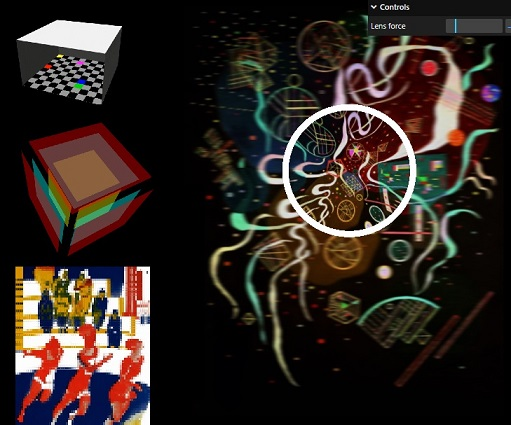

# shaders-collection

For start: 

  clone repo, 
  npm i,
  npm run build:dev

  

Examples:

  1. MovingLayers - pulse position of several copies of body surfaces
  2. DiscoFloor - random color blinking
  3. Glasses - blur and lens effects
  4. Pixelization - low resolution effect
